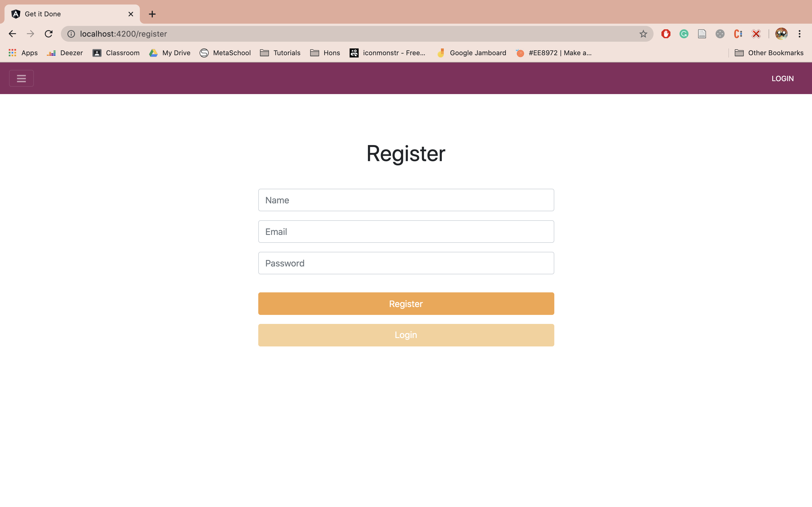
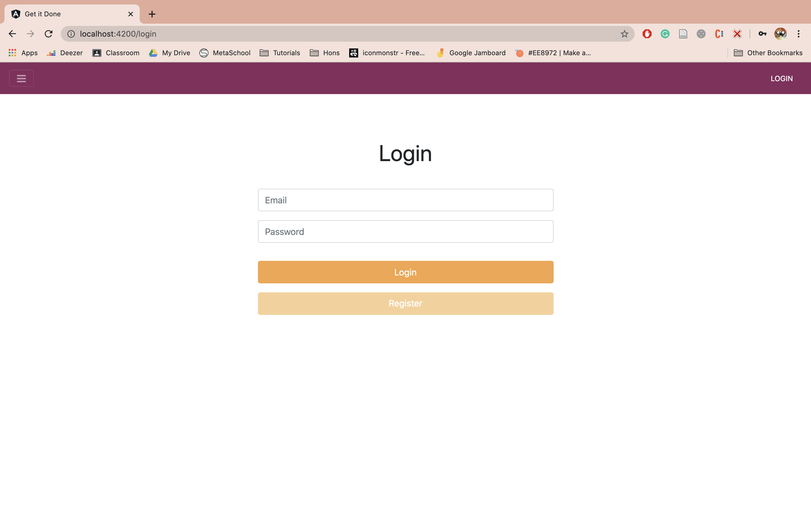
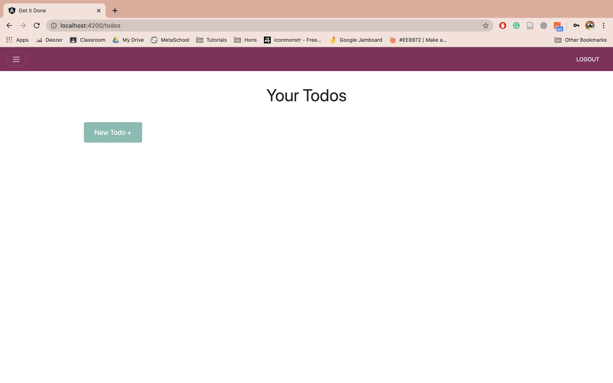
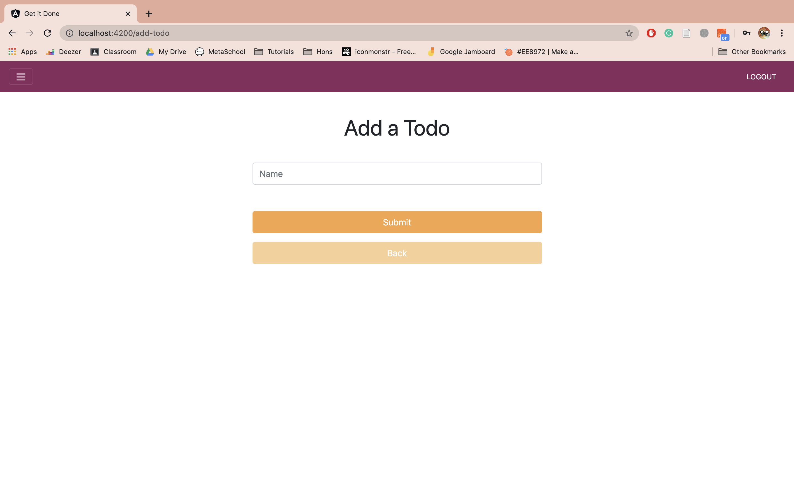
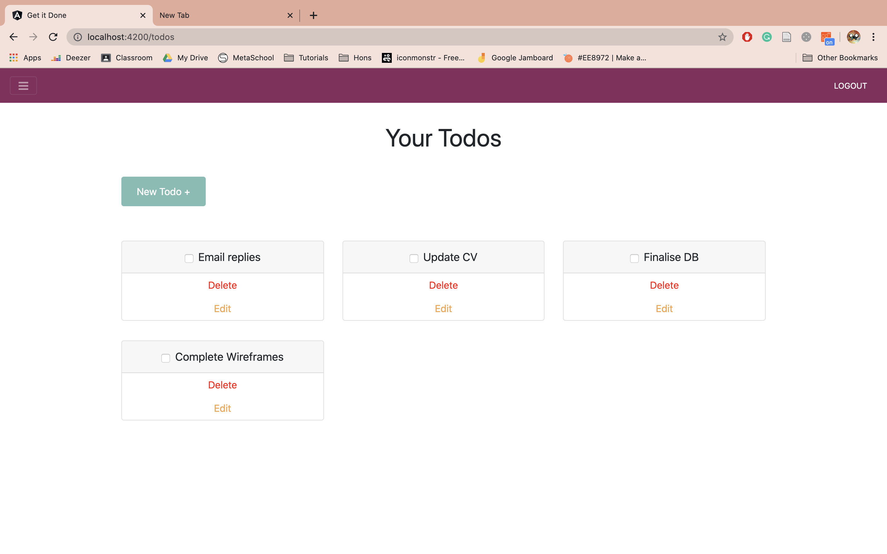

# Get It Done

Get it done is a todo application.

The backend was created with [lumen]
The frontend was created with [angularjs]
Styling was done using [bootstrap]

### Why Lumen?

Lumen is a lightweight, minimal laravel framework.
I chose to use this for the backend, as this is a small test project.

### Features

  - Register a user
  - Login
  - Create a todo item
  - Edit/Delete a todo item


### Installation

Clone the repository onto your machine

##### Backend

First set up the backend in your terminal by navigating to the project folder:

```sh
$ cd ToDo
$ cd ToDo
$ composer install
```

Next, you'll need to create a postgres database, and update the .env file to match your credentials.
The .env file should look as follows:

```sh
APP_ENV=local
APP_DEBUG=true
APP_TIMEZONE=UTC

LOG_CHANNEL=stack
LOG_SLACK_WEBHOOK_URL=

DB_CONNECTION=pgsql
DB_HOST=127.0.0.1
DB_PORT=YOUR_DB_PORT
DB_DATABASE=YOUR_DB_NAME
DB_USERNAME=YOUR_DB_USERNAME
DB_PASSWORD=YOUR_DB_PASSWORD

CACHE_DRIVER=file
QUEUE_DRIVER=sync
```

Finally, run the following commands in your terminal:

```sh
$ php artisan migrate
$ php -S localhost:8000 -t public
```

##### Frontend

Next you'll set up the frontend in your terminal by navigating to the project folder:

```sh
$ cd ToDo
$ cd ToDoList
$ npm install
$ ng serve -o
```

### Running the project

Now you should be ready to navigate to http://localhost:4200/ which will open on a login page. 

Register yourself, login, and start getting organised with your todo list!


### Todos (to be done by Friday COB)

 - Implement the User Profile page
 
 
### Example Images








   [lumen]: <https://lumen.laravel.com/>
   [angularjs]: <https://angularjs.org/>
   [bootstrap]: <https://getbootstrap.com/>

